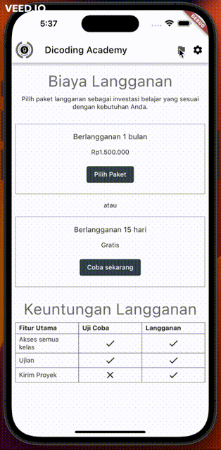

## Description

Projek ini merupakan projek latihan melokalisasi aplikasi flutter dan memanfaatkan provider agar state lokal dapat diatur dengan mudah. 

## Development Setup

Clone the repository and run the following commands:

```
flutter pub get
flutter run
```

## Source

[Dicoding Academy](https://www.dicoding.com/academies/195)

## Screenshot

 
